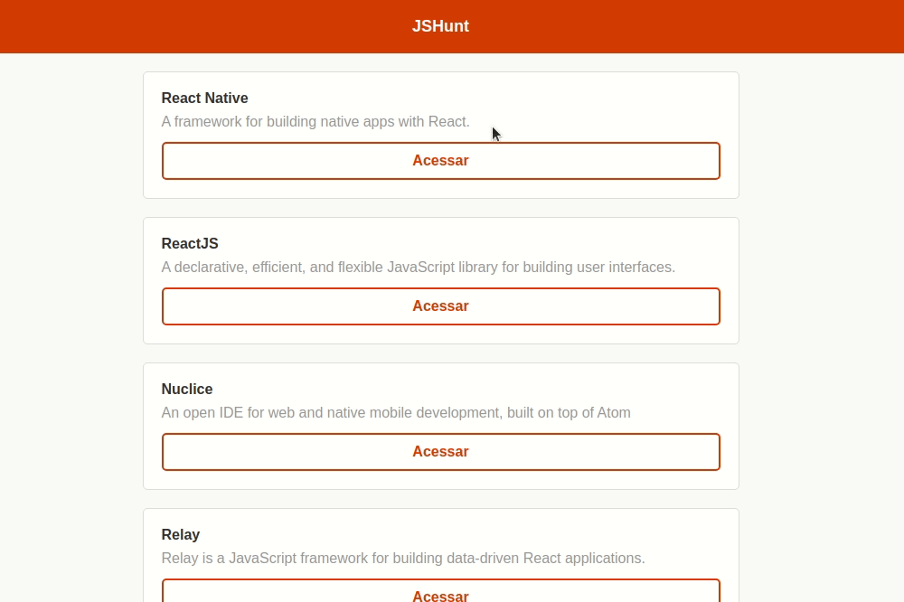

<h1>huntweb</h1>

## Índice

- [Preview](#Preview)
- [Sobre](#Sobre)
- [Tecnologias utilizadas](#Tecnologias-utilizadas)
- [Como executar o projeto](#Como-executar-o-projeto)

---

## Preview

<p align="center">
  
</p>

---

## Sobre

Huntweb é uma aplicação desenvolvida como forma de exercitar meus conhecimentos em React, consumos de API e paginação.

---

## Tecnologias utilizadas

O projeto está desenvolvido utilizando as seguintes tecnologias:

- HTML
- CSS
- JavaScript
- React

---

## Como executar o projeto

Requisitos: você precisará ter o git e o yarn instalados em sua máquina.

```bash
# Clonar o repositório
git clone https://github.com/lu1zf/huntweb.git

# Entrar no diretório
cd huntweb

#instalar dependências do projeto
yarn

#iniciar a aplicação
yarn start
```

Feito isso, o projeto estará disponível no endereço http://localhost:3000 .

---

Feito com ♥ por Luiz Silva
